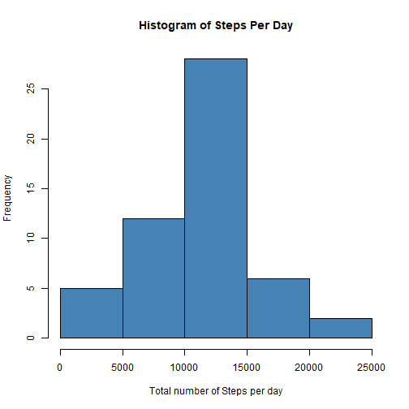
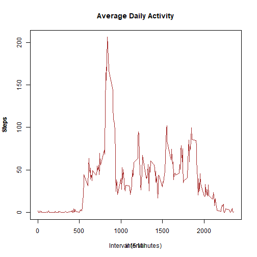
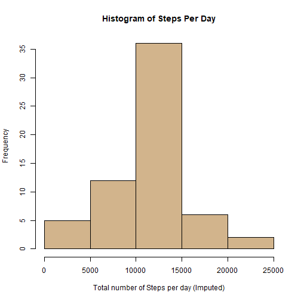
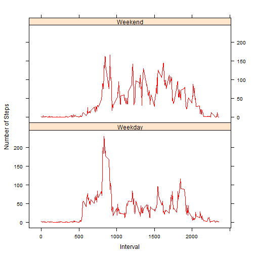

## "Analysis with Personal movement data"

This analyis is from the personal movement data collected with Activity monitoring devices.


### Download Activity monitoring data

```r
fileurl <- "https://d396qusza40orc.cloudfront.net/repdata%2Fdata%2Factivity.zip"
filename <- "repdataFdataFactivity.zip"
if (!file.exists(filename)) {
        download.file(fileurl, filename)
}
if (file.exists(filename) & !file.exists("activity.csv")){
        unzip(filename)
}
```

### 1.Read Activity data from file

```r
df <- read.csv("activity.csv", sep = ",", header= TRUE)
str(df)
```

```
## 'data.frame':	17568 obs. of  3 variables:
##  $ steps   : int  NA NA NA NA NA NA NA NA NA NA ...
##  $ date    : Factor w/ 61 levels "2012-10-01","2012-10-02",..: 1 1 1 1 1 1 1 1 1 1 ...
##  $ interval: int  0 5 10 15 20 25 30 35 40 45 ...
```

### 2.Histogram for Total number of steps taken per day

```r
df$date <- as.Date(df$date)
p2 <- with(df, aggregate(steps ~ date, FUN = sum, na.rm = TRUE))
hist(p2$steps, main="Histogram of Steps Per Day", xlab = "Total number of Steps per day", col = "steelblue")
```




### 3.Display Mean & Median for steps per day

```r
p3 <- with(df, aggregate(steps ~ date, FUN = mean, na.rm = TRUE))
names(p3) <- c("Date", "Mean")
p3_tmp <- with(df, aggregate(steps ~ date, FUN = median, na.rm = TRUE))
names(p3_tmp) <- c("Date", "Median")
p3 <- merge(p3, p3_tmp, by = "Date")
print(p3, type="HTML")
```

```
##          Date       Mean Median
## 1  2012-10-02  0.4375000      0
## 2  2012-10-03 39.4166667      0
## 3  2012-10-04 42.0694444      0
## 4  2012-10-05 46.1597222      0
## 5  2012-10-06 53.5416667      0
## 6  2012-10-07 38.2465278      0
## 7  2012-10-09 44.4826389      0
## 8  2012-10-10 34.3750000      0
## 9  2012-10-11 35.7777778      0
## 10 2012-10-12 60.3541667      0
## 11 2012-10-13 43.1458333      0
## 12 2012-10-14 52.4236111      0
## 13 2012-10-15 35.2048611      0
## 14 2012-10-16 52.3750000      0
## 15 2012-10-17 46.7083333      0
## 16 2012-10-18 34.9166667      0
## 17 2012-10-19 41.0729167      0
## 18 2012-10-20 36.0937500      0
## 19 2012-10-21 30.6284722      0
## 20 2012-10-22 46.7361111      0
## 21 2012-10-23 30.9652778      0
## 22 2012-10-24 29.0104167      0
## 23 2012-10-25  8.6527778      0
## 24 2012-10-26 23.5347222      0
## 25 2012-10-27 35.1354167      0
## 26 2012-10-28 39.7847222      0
## 27 2012-10-29 17.4236111      0
## 28 2012-10-30 34.0937500      0
## 29 2012-10-31 53.5208333      0
## 30 2012-11-02 36.8055556      0
## 31 2012-11-03 36.7048611      0
## 32 2012-11-05 36.2465278      0
## 33 2012-11-06 28.9375000      0
## 34 2012-11-07 44.7326389      0
## 35 2012-11-08 11.1770833      0
## 36 2012-11-11 43.7777778      0
## 37 2012-11-12 37.3784722      0
## 38 2012-11-13 25.4722222      0
## 39 2012-11-15  0.1423611      0
## 40 2012-11-16 18.8923611      0
## 41 2012-11-17 49.7881944      0
## 42 2012-11-18 52.4652778      0
## 43 2012-11-19 30.6979167      0
## 44 2012-11-20 15.5277778      0
## 45 2012-11-21 44.3993056      0
## 46 2012-11-22 70.9270833      0
## 47 2012-11-23 73.5902778      0
## 48 2012-11-24 50.2708333      0
## 49 2012-11-25 41.0902778      0
## 50 2012-11-26 38.7569444      0
## 51 2012-11-27 47.3819444      0
## 52 2012-11-28 35.3576389      0
## 53 2012-11-29 24.4687500      0
```


### 4.Time Series Plot for Steps at 5 mintues interval (Averaged per day)

```r
p4 <- with(df, aggregate(steps ~ interval, FUN = mean, na.rm = TRUE))
with (p4, plot(interval, steps, type="l", col="brown"))
title (main="Average Daily Activity", xlab = "Interval (5 Minutes)", ylab = "Steps")
```



### 5.Interval having maximum number of Steps

```r
p5 <- p4[p4$steps==max(p4$steps),]
print(p5)
```

```
##     interval    steps
## 104      835 206.1698
```

Maximum number of steps **206.1698113** (averaged across all days) was observed at **08:35** AM.

### 6.Impute Missing Data

```r
miss <- sum(is.na(df$steps))
```
There are **2304** missing values in the data set for steps. The missing values are imputed using the average value for the same 5 minutes interval which are available. The data and histogram bellow is for the data set after imputing the missing values.
        

```r
# Impute
df_new <- df[is.na(df$steps),]
df_new$steps <- 0
p4 <- with(df, aggregate(steps ~ interval, FUN = mean, na.rm = TRUE))
df_new <- transform(df_new, steps = p4$steps[match(interval, p4$interval)])
d <- df[!(is.na(df$steps)),]
df_new <-rbind(d, df_new)

# Compute Mean, Meadian
p6 <- with(df_new, aggregate(steps ~ date, FUN = mean, na.rm = TRUE))
names(p6) <- c("Date", "Mean")
p6_tmp <- with(df_new, aggregate(steps ~ date, FUN = median, na.rm = TRUE))
names(p6_tmp) <- c("Date", "Median")
p6 <- merge(p6, p6_tmp, by = "Date")

print(p6, type="HTML")
```

```
##          Date       Mean   Median
## 1  2012-10-01 37.3825996 34.11321
## 2  2012-10-02  0.4375000  0.00000
## 3  2012-10-03 39.4166667  0.00000
## 4  2012-10-04 42.0694444  0.00000
## 5  2012-10-05 46.1597222  0.00000
## 6  2012-10-06 53.5416667  0.00000
## 7  2012-10-07 38.2465278  0.00000
## 8  2012-10-08 37.3825996 34.11321
## 9  2012-10-09 44.4826389  0.00000
## 10 2012-10-10 34.3750000  0.00000
## 11 2012-10-11 35.7777778  0.00000
## 12 2012-10-12 60.3541667  0.00000
## 13 2012-10-13 43.1458333  0.00000
## 14 2012-10-14 52.4236111  0.00000
## 15 2012-10-15 35.2048611  0.00000
## 16 2012-10-16 52.3750000  0.00000
## 17 2012-10-17 46.7083333  0.00000
## 18 2012-10-18 34.9166667  0.00000
## 19 2012-10-19 41.0729167  0.00000
## 20 2012-10-20 36.0937500  0.00000
## 21 2012-10-21 30.6284722  0.00000
## 22 2012-10-22 46.7361111  0.00000
## 23 2012-10-23 30.9652778  0.00000
## 24 2012-10-24 29.0104167  0.00000
## 25 2012-10-25  8.6527778  0.00000
## 26 2012-10-26 23.5347222  0.00000
## 27 2012-10-27 35.1354167  0.00000
## 28 2012-10-28 39.7847222  0.00000
## 29 2012-10-29 17.4236111  0.00000
## 30 2012-10-30 34.0937500  0.00000
## 31 2012-10-31 53.5208333  0.00000
## 32 2012-11-01 37.3825996 34.11321
## 33 2012-11-02 36.8055556  0.00000
## 34 2012-11-03 36.7048611  0.00000
## 35 2012-11-04 37.3825996 34.11321
## 36 2012-11-05 36.2465278  0.00000
## 37 2012-11-06 28.9375000  0.00000
## 38 2012-11-07 44.7326389  0.00000
## 39 2012-11-08 11.1770833  0.00000
## 40 2012-11-09 37.3825996 34.11321
## 41 2012-11-10 37.3825996 34.11321
## 42 2012-11-11 43.7777778  0.00000
## 43 2012-11-12 37.3784722  0.00000
## 44 2012-11-13 25.4722222  0.00000
## 45 2012-11-14 37.3825996 34.11321
## 46 2012-11-15  0.1423611  0.00000
## 47 2012-11-16 18.8923611  0.00000
## 48 2012-11-17 49.7881944  0.00000
## 49 2012-11-18 52.4652778  0.00000
## 50 2012-11-19 30.6979167  0.00000
## 51 2012-11-20 15.5277778  0.00000
## 52 2012-11-21 44.3993056  0.00000
## 53 2012-11-22 70.9270833  0.00000
## 54 2012-11-23 73.5902778  0.00000
## 55 2012-11-24 50.2708333  0.00000
## 56 2012-11-25 41.0902778  0.00000
## 57 2012-11-26 38.7569444  0.00000
## 58 2012-11-27 47.3819444  0.00000
## 59 2012-11-28 35.3576389  0.00000
## 60 2012-11-29 24.4687500  0.00000
## 61 2012-11-30 37.3825996 34.11321
```

```r
diff <- round((sum(df_new$steps, na.rm=TRUE) - sum(df$steps, na.rm=TRUE)) / sum(df_new$steps, na.rm=TRUE) * 100, 2)
```


**Observation :** There were 8 days of data that were missing intitially. Post imputing we could see the data for those 8 days and an increase in total steps by **13.11**


### 7.Histogram for Imputed data

```r
# Plot Hist
p7 <- with(df_new, aggregate(steps ~ date, FUN = sum, na.rm = TRUE))
hist(p7$steps, main="Histogram of Steps Per Day", xlab = "Total number of Steps per day (Imputed)", col = "tan")
```




### 8.Average Step Activity (Weekday Vs Weekend)

```r
library(dplyr)
```

```
## 
## Attaching package: 'dplyr'
```

```
## The following objects are masked from 'package:stats':
## 
##     filter, lag
```

```
## The following objects are masked from 'package:base':
## 
##     intersect, setdiff, setequal, union
```

```r
library(lattice)

df_new$daytype <- ifelse( weekdays(df_new$date) %in% c("Saturday", "Sunday") , "Weekend", "Weekday")
p8 <- df_new %>% select (daytype, interval, steps) %>% group_by(daytype, interval) %>% summarize ("steps" = mean(steps))
p8 <- transform(p8, daytype = factor(daytype))

xyplot (steps ~ interval | daytype, data =p8, layout = c(1,2), type = "l", xlab="Interval", ylab="Number of Steps", col="red")
```


